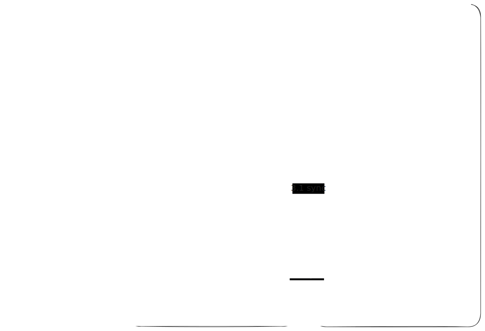
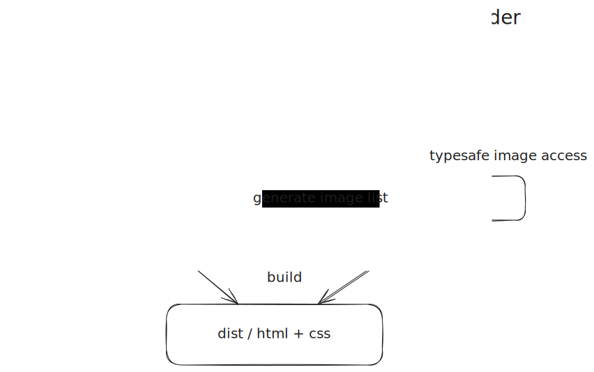
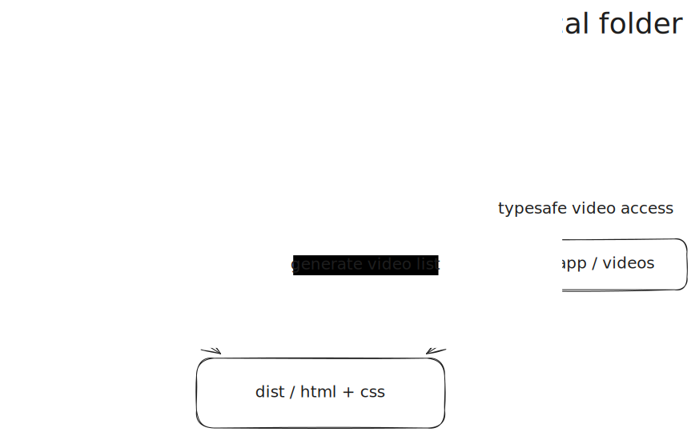

# @adaptive-ds/assets-optimizer

Process, hash, sync, and clean image assets for web projects that keep originals outside git and sync through any `rclone` remote, with a separate pass for web videos.

This package is built for a workflow with two local directories:

- `images`: original source images, never modified
- `public/images`: generated optimized images, flat output only
- `videos`: original source videos, optional
- `public/videos`: processed videos, optional

It is designed for projects where:

- originals live on an `rclone` remote and are synced locally
- optimized outputs should be deterministic and aggressively cacheable
- output filenames should change when either the source file or the transform changes
- old optimized files should be removed locally and remotely
- generated `imageList.ts` and `videoList.ts` should stay in sync with processed assets

## Diagrams





## What It Does

`assetsOptimize()` performs the full asset pipeline:

1. Resolves the project name from `package.json.name`
2. Uses that as the base path on your configured `rclone` remote
3. Syncs originals between the remote and `images`
4. Scans transform folders like `1920x1080_jpg`
5. Processes matching image source files with `sharp`
6. Writes flat optimized images into `public/images`
7. Names image files as `<basename>_<hash>.<ext>`
8. Skips already-generated images
9. Deletes stale optimized images locally
10. Uploads missing optimized images to the remote with cache headers
11. Deletes stale optimized images from the remote
12. Runs a separate optional video pass from `videos` to `public/videos`
13. Generates a `.jpg` preview beside each processed video using the processed video dimensions
14. Keeps video filenames unchanged and skips any processed video or preview that already exists
15. Uploads missing processed videos and previews to the remote without deleting manual variants
16. Generates `src/app/assets/imageList.ts` and `src/app/assets/videoList.ts` by default
17. Prints a clear summary of what changed

The hash is derived from:

- source file bytes
- normalized transform spec

That means image cache keys change when the source image changes or when you change the folder rule, even if the output filename format stays short.

## Folder Convention

Original files belong in transform folders inside `images`.

Example:

```text
images/
  1920x1080_jpg/
    kitchen.jpg
    living-room.png
  1200x1200_webp/
    kitchen.jpg
```

This produces flat optimized image output like:

```text
public/images/
  kitchen_a1b2c3d4.jpg
  living-room_9f8e7d6c.jpg
  kitchen_7c6b5a4d.webp
```

Root-level files directly inside `images` are intentionally skipped and warned on every run.

Videos are handled separately and do not use transform folders:

```text
videos/
  hero.mp4
  intro.webm

public/videos/
  hero.mp4
  hero.jpg
  intro.webm
  intro.jpg
```

Video behavior:

- if both local `videos` and remote `video-originals` are missing, the video pass does nothing
- source videos sync through `video-originals`
- processed videos sync through `video-processed`
- missing processed videos are created with `ffmpeg`
- missing preview images are created as `.jpg` files beside processed videos
- existing processed videos are skipped and preserved as manual transformations
- existing preview images are skipped and preserved
- video filenames and relative paths are kept as-is
- stale processed videos are not deleted

## Transform Folder Format

Folder names must use:

```text
<width>x<height>_<format>
```

Supported image output formats:

- `jpg`
- `png`
- `webp`
- `avif`
Examples:

- `1920x1080_jpg`
- `1600x900_webp`
- `800x800_avif`
Image processing behavior:

- resize fit: `inside` / max-bounds scaling
- `withoutEnlargement: true`
- image auto-rotation is applied
- default quality is `80`

Supported video source extensions:

- `mp4`
- `mov`
- `m4v`
- `webm`
- `avi`
- `mkv`

## Defaults

If you call `assetsOptimize()` with no arguments, it uses:

- `cwd`: `process.cwd()`
- `projectName`: `package.json.name`
- `processImages`: `true`
- `imageOriginalsDir`: `./images`
- `imageOptimizedDir`: `./public/images`
- `allowRootImageFiles`: `false`
- `processVideos`: `true`
- `videosDir`: `./videos`
- `processedVideosDir`: `./public/videos`
- `imageListOutputPath`: `./src/app/assets/imageList.ts`
- `videoListOutputPath`: `./src/app/assets/videoList.ts`
- `generateImageList`: `true`
- `generateVideoList`: `true`
- `videoPreviewQuality`: `80`
- `rcloneRemote`: `leo`
- `remoteImageOriginalsDir`: `image-originals`
- `remoteImageOptimizedDir`: `image-processed`
- `remoteVideoOriginalsDir`: `video-originals`
- `remoteVideoProcessedDir`: `video-processed`
- `cacheControlHeader`: `public,max-age=31536000,immutable`

So for a project named `moramontage`, the remote paths become:

- `leo:moramontage/image-originals`
- `leo:moramontage/image-processed`
- `leo:moramontage/video-originals`
- `leo:moramontage/video-processed`

## Installation

```bash
bun add @adaptive-ds/assets-optimizer
```

## Basic Usage

Example project entrypoint:

```ts
import { assetsOptimize } from "@adaptive-ds/assets-optimizer"

await assetsOptimize()
```

This generates optimized images, processed videos, video preview JPGs, `imageList.ts`, and `videoList.ts` in one run. Existing image alt text and existing video preview alt text are preserved when the generated files already exist.

## API

```ts
import { assetsOptimize } from "@adaptive-ds/assets-optimizer"

const result = await assetsOptimize(options)
```

### `OptimizeImagesWebOptions`

```ts
interface OptimizeImagesWebOptions {
  cwd?: string
  projectName?: string
  processImages?: boolean
  imageOriginalsDir?: string
  imageOptimizedDir?: string
  allowRootImageFiles?: boolean
  imageListOutputPath?: string
  imageListImportPath?: string
  generateImageList?: boolean
  processVideos?: boolean
  videosDir?: string
  processedVideosDir?: string
  videoListOutputPath?: string
  videoListImportPath?: string
  generateVideoList?: boolean
  videoPreviewQuality?: number
  rcloneRemote?: string
  remoteImageOriginalsDir?: string
  remoteImageOptimizedDir?: string
  remoteVideoOriginalsDir?: string
  remoteVideoProcessedDir?: string
  cacheControlHeader?: string
}
```

### `OptimizeImagesWebResult`

```ts
interface OptimizeImagesWebResult {
  processed: string[]
  skippedExisting: string[]
  skippedRootFiles: string[]
  warnings: string[]
  deletedLocal: string[]
  uploadedRemote: string[]
  deletedRemote: string[]
  processedVideos: string[]
  skippedExistingVideos: string[]
  uploadedRemoteVideos: string[]
  processedVideoPreviews: string[]
  skippedExistingVideoPreviews: string[]
  uploadedRemoteVideoPreviews: string[]
}
```

## Example With Custom Paths

```ts
import { assetsOptimize } from "@adaptive-ds/assets-optimizer"

await assetsOptimize({
  processImages: true,
  imageOriginalsDir: "./assets/originals",
  imageOptimizedDir: "./assets/optimized",
  allowRootImageFiles: false,
  imageListOutputPath: "./src/app/assets/imageList.ts",
  processVideos: true,
  videoListOutputPath: "./src/app/assets/videoList.ts",
  videoPreviewQuality: 80,
  rcloneRemote: "leo",
  remoteImageOriginalsDir: "image-originals",
  remoteImageOptimizedDir: "image-processed",
  cacheControlHeader: "public,max-age=31536000,immutable",
})
```

## Requirements

- `bun`
- `rclone`
- `ffmpeg`
- an existing `rclone` remote, defaulting to `leo`
- write access to the target bucket/path
- Node/Bun environment capable of running `sharp`

This package assumes the remote bucket/path already exists or can be created by `rclone mkdir`.

## Cleanup Behavior

The package does not use a manifest.

Instead it derives the expected output set from the current originals and current transform folders, then reconciles that against:

- local `public/images`
- remote `image-processed` objects

That means:

- files no longer produced by the current source set are deleted
- renaming or removing a source file cleans up stale optimized files
- changing a transform folder causes a different hash and a different output filename

## Recommended Workflow

1. Add or sync originals into `images/<transform-folder>/`
2. Run your local image pipeline entrypoint
3. Regenerate your typed image list
4. Reference the generated hashed filenames from app code or derived metadata

## Important Caveat

If your project currently stores source images directly at the root of `images`, this package will skip them by design.

Before adopting it fully, move originals into explicit transform folders such as:

```text
images/1920x1080_jpg/
```

That contract is what makes the output deterministic and safe to clean automatically.

## Publishing

This package is intended to be published from:

- npm package: `@adaptive-ds/assets-optimizer`
- homepage: `https://github.com/david1gp/assets-optimizer`
- generated asset lists import types from this package name by default unless you override `imageListImportPath` or `videoListImportPath`

## License

MIT
